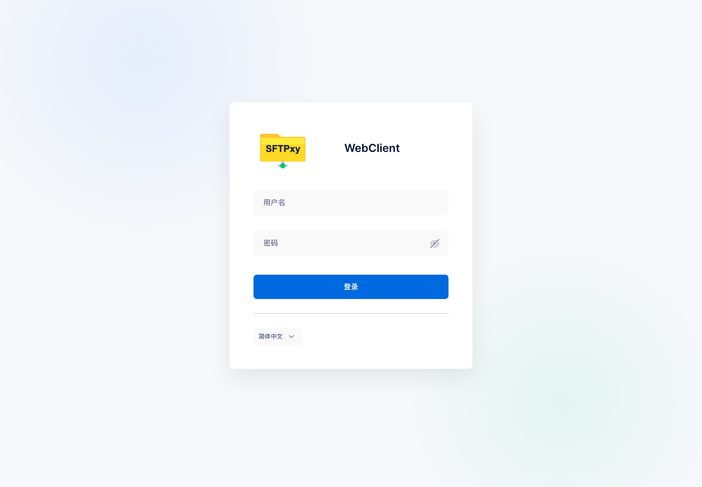
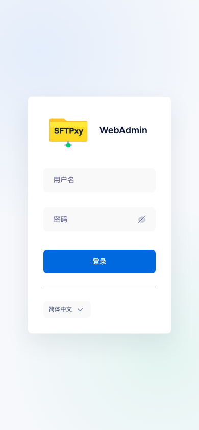

# SFTPxy

[](https://github.com/jincaiw/sftpxy/actions)
[](./LICENSE)

SFTPxy is a production-ready file transfer service with SFTP, WebAdmin, WebClient, FTP/S, WebDAV, REST APIs, and pluggable storage backends. It is designed for private infrastructure where a single binary, a systemd service, or a Docker container should be enough to run a stable transfer service.

Default service ports:

| Service | URL or port |
| --- | --- |
| WebAdmin and REST/OpenAPI | `http://localhost:30080/` |
| WebClient | `http://localhost:30081/` |
| SFTP | `30082` |
| FTP passive range | `30085-30088` |

The web interface defaults to Chinese (`zh-CN`). English remains available from the language selector.

## Demo






## Quick Start

Download the latest release from [GitHub Releases](https://github.com/jincaiw/sftpxy/releases), extract the archive for your platform, and start the service:

```bash
./SFTPxy serve -c .
```

For a first local run you can create a default administrator:

```bash
SFTPXY_DATA_PROVIDER__CREATE_DEFAULT_ADMIN=1 \
SFTPXY_DEFAULT_ADMIN_USERNAME=admin \
SFTPXY_DEFAULT_ADMIN_PASSWORD='change-this-password' \
SFTPXY_COMMON__SECRET_MIN_ENTROPY=0 \
./SFTPxy serve -c .
```

Open `http://localhost:30080/`, sign in, then change the generated bootstrap credentials before production use.

## Linux Single-Binary Deployment

This layout keeps executable, configuration, state, and user data separate:

```bash
sudo install -d -m 0755 /etc/SFTPxy /usr/local/bin /srv/SFTPxy/data
sudo install -d -m 0750 /var/lib/SFTPxy /var/log/SFTPxy

sudo install -m 0755 SFTPxy /usr/local/bin/SFTPxy
sudo cp SFTPxy.json /etc/SFTPxy/SFTPxy.json
sudo cp -R templates static openapi /etc/SFTPxy/
```

Create the first admin account on the first boot:

```bash
sudo SFTPXY_DATA_PROVIDER__CREATE_DEFAULT_ADMIN=1 \
  SFTPXY_DEFAULT_ADMIN_USERNAME=admin \
  SFTPXY_DEFAULT_ADMIN_PASSWORD='replace-with-a-strong-password' \
  SFTPXY_COMMON__SECRET_MIN_ENTROPY=0 \
  /usr/local/bin/SFTPxy serve -c /etc/SFTPxy
```

After the first login, stop the temporary foreground process and run SFTPxy using systemd.

## systemd Deployment

Create a dedicated account:

```bash
sudo useradd --system --home /var/lib/SFTPxy --shell /usr/sbin/nologin SFTPxy
sudo chown -R SFTPxy:SFTPxy /var/lib/SFTPxy /srv/SFTPxy /var/log/SFTPxy
sudo chown -R root:SFTPxy /etc/SFTPxy
sudo chmod 0750 /etc/SFTPxy
```

Install the service:

```bash
sudo cp init/SFTPxy.service /etc/systemd/system/SFTPxy.service
sudo tee /etc/SFTPxy/SFTPxy.env >/dev/null <<'EOF'
SFTPXY_DATA_PROVIDER__CREATE_DEFAULT_ADMIN=1
SFTPXY_DEFAULT_ADMIN_USERNAME=admin
SFTPXY_DEFAULT_ADMIN_PASSWORD=replace-with-a-strong-password
SFTPXY_COMMON__SECRET_MIN_ENTROPY=0
EOF

sudo systemctl daemon-reload
sudo systemctl enable --now SFTPxy
sudo systemctl status SFTPxy
```

After the default admin is created and a permanent password is set, remove the bootstrap variables from `/etc/SFTPxy/SFTPxy.env` and restart:

```bash
sudo sed -i '/CREATE_DEFAULT_ADMIN/d;/DEFAULT_ADMIN_/d;/SECRET_MIN_ENTROPY/d' /etc/SFTPxy/SFTPxy.env
sudo systemctl restart SFTPxy
```

## Docker Deployment

The Docker image is published as `qing1205/sftpxy`.

```bash
docker run -d --name sftpxy \
  -p 30080:30080 \
  -p 30081:30081 \
  -p 30082:30082 \
  -p 30085-30088:30085-30088 \
  -e SFTPXY_DATA_PROVIDER__CREATE_DEFAULT_ADMIN=1 \
  -e SFTPXY_DEFAULT_ADMIN_USERNAME=admin \
  -e SFTPXY_DEFAULT_ADMIN_PASSWORD='replace-with-a-strong-password' \
  -e SFTPXY_COMMON__SECRET_MIN_ENTROPY=0 \
  -v sftpxy-config:/etc/SFTPxy \
  -v sftpxy-data:/srv/SFTPxy \
  qing1205/sftpxy:v0.2.1
```

Docker Compose:

```yaml
services:
  sftpxy:
    image: qing1205/sftpxy:v0.2.1
    container_name: sftpxy
    restart: unless-stopped
    ports:
      - "30080:30080"
      - "30081:30081"
      - "30082:30082"
      - "30085-30088:30085-30088"
    environment:
      SFTPXY_DATA_PROVIDER__CREATE_DEFAULT_ADMIN: "1"
      SFTPXY_DEFAULT_ADMIN_USERNAME: admin
      SFTPXY_DEFAULT_ADMIN_PASSWORD: replace-with-a-strong-password
      SFTPXY_COMMON__SECRET_MIN_ENTROPY: "0"
    volumes:
      - sftpxy-config:/etc/SFTPxy
      - sftpxy-data:/srv/SFTPxy

volumes:
  sftpxy-config:
  sftpxy-data:
```

## Release Artifacts

Release `v0.2.1` provides:

- Linux packages and portable archives.
- Windows installers and portable archives.
- Source archive with vendored dependencies.
- Docker image `qing1205/sftpxy:v0.2.1` and `qing1205/sftpxy:latest`.

## Configuration Notes

- Keep WebAdmin and REST/OpenAPI on `30080`.
- Keep WebClient on `30081`.
- Keep SFTP on `30082`.
- Use `30085-30088` for passive FTP when FTP is enabled.
- Prefer environment variables in `/etc/SFTPxy/SFTPxy.env` or Docker environment entries for secrets.
- Do not commit local databases, logs, runtime keys, release bundles, or private configuration overrides.

## License

SFTPxy is licensed under the [MIT License](./LICENSE).
